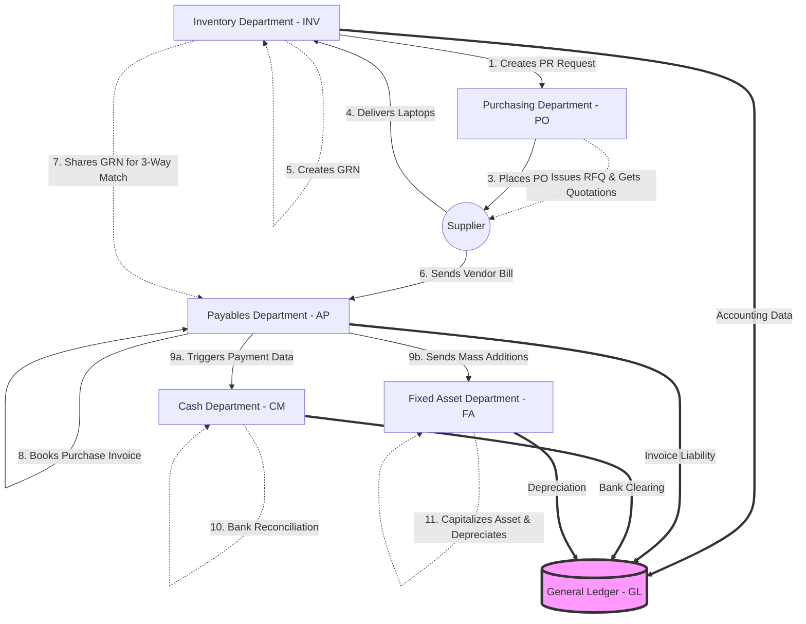

# Day 3 — Oracle Fusion Procure-to-Pay (P2P) Cycle

**Topic:** The Purchase Process and Departmental Flow

In Oracle Fusion, buying something for a company isn't just a single click. It involves an entire lifecycle called the **Procure-to-Pay (P2P)** cycle. This process touches multiple different departments and Oracle modules before the transaction is fully complete.

## 1. Official Oracle Fusion Module Abbreviations (The P2P Stack)
In the ERP industry, professionals rarely use the full department names. Instead, they refer to the specific Oracle Fusion modules using their official acronyms. You must memorize these:

- **INV** = Oracle Fusion Inventory
- **PO** = Oracle Fusion Purchasing *(Note: The "Purchasing" umbrella often includes both Oracle Sourcing and Oracle Purchasing modules).*
- **AP** = Oracle Fusion Accounts Payable
- **FA** = Oracle Fusion Fixed Assets
- **CM** = Oracle Fusion Cash Management 
- **GL** = Oracle Fusion General Ledger

---

## 2. Real-World Example: Buying 100 Laptops
To understand the Procure-to-Pay process, let's look at a real-world scenario where a company needs to buy 100 laptops. Here is how the transaction flows across different departments in Oracle Fusion:

### Step 1: Inventory / Warehouse Department
- **Stock Check:** The process starts here. The department checks if there are 100 laptops in stock. 
- **Purchase Requisition (PR):** Since there is no stock, they create a **Purchase Requisition (PR)** requesting to buy 100 laptops.
- **Approvals:** The PR is sent for internal approvals (e.g., the IT Manager approves the request).

### Step 2: Purchasing (Procurement) Department
- **RFQ Creation:** The Purchasing team receives the approved PR. They create a **Request for Quotation (RFQ)** and send it to multiple suppliers.
- **Quotation Analysis:** Various vendors reply with their quotations (pricing). The Purchasing team analyzes the quotes and selects the best vendor.
- **Purchase Order (PO):** They place a formal **Purchase Order (PO)** with the chosen vendor. This PO also goes through an internal approval hierarchy before being sent to the vendor.

### Step 3: Receiving (Inventory Department)
- **GRN (Goods Receipt Note):** The vendor delivers the 100 laptops. The Inventory team receives them into the warehouse and creates a **GRN (Goods Receive Note)** in the system.
- **Purchase Returns:** If any laptops are damaged or defective, the Inventory team will process a Purchase Return back to the vendor.

### Step 4: Payables (Accounts Payable) Department
- **Purchase Invoice (PI):** The vendor sends the bill. The Payables team enters this into the system as a Purchase Invoice. 
- ***Crucial Rule:*** Whether you are buying an *Item* (laptop), a *Service* (office cleaning), an *Expense* (employee travel), or a *Fixed Asset* (machinery), **all of them must have a Purchase Invoice booked in the Payables department.**
- **Payment Initiation:** Once the invoice is validated against the PO and GRN, Payables marks it as ready for payment.

### Step 5: Fixed Asset Department (Capitalization)
- **Data Sharing:** The Payables team does not share every invoice with the Assets team—they **only share Fixed Asset-related Purchase Invoices** (like these laptops). 
- **Asset Creation:** The Asset team receives this data, creates the laptops as "Fixed Assets" in the system, and sets up rules to calculate **Depreciation** over the next few years.

### Step 6: Cash Management Department
- **Payment & Bank Accounts:** Payables tells the Cash Department about the payment transaction. The Cash Department actually holds and manages the company's **Bank Accounts**. They process the final payment out of the bank.
- **Bank Statement Reconciliation:** The Cash Department must reconcile internal system records with actual bank statements. *For example: If the Payables module says 15 payments were issued today, but the daily bank statement shows only 10 payments actually cleared the bank, the Cash team must investigate and reconcile the issue.*

### Step 7: General Ledger (The Common Department)
- **Reporting:** The General Ledger (GL) is the "common department" where all the financial data from Inventory, Purchasing, Payables, Assets, and Cash flows together. If management needs a **Financial Report** (like a Balance Sheet, P&L, or custom audit report), the GL team generates it from this centralized hub.

---

## 3. Comparing Purchase Types with Examples
The "100 Laptops" example above represents the most complex flow because a laptop is both an **Item** (it goes into Inventory) and a **Fixed Asset** (it depreciates). 

However, the P2P cycle changes depending on *what* you are buying. Let's look at 4 different examples:

| Purchase Type | Example | How the Flow Changes |
| :--- | :--- | :--- |
| **1. Item (Standard)** | Buying 500 reams of printer paper. | Follows the standard flow (PR ➔ PO ➔ GRN ➔ Invoice ➔ Payment). It **skips** the Fixed Asset department because paper is used up immediately, not depreciated. |
| **2. Fixed Asset** | Buying a $50,000 factory machine. | Follows the full flow. Payables shares the Invoice with the **Fixed Assets** department via "Mass Additions" so it can be capitalized and depreciated over 10 years. |
| **3. Service** | Hiring a company for weekly office cleaning. | You still create a PR and PO, but you **skip Inventory/GRN** because you cannot physically store "cleaning" in a warehouse. Payables receives the invoice directly against the PO. |
| **4. Expense** | An employee buys a $50 train ticket for a business trip. | Often **skips Purchasing (no PO)** and **skips Inventory**. The employee simply submits an Expense Report. The Payables department books the Expense Invoice and the Cash department reimburses the employee. |

---

## 4. Visualizing the Flow (Mermaid Graph)

Here is a visual representation of how the data and responsibilities flow between the departments:

### Summary of the Flow
1. **Inventory** asks for the laptops (PR) and receives them (GRN).
2. **Purchasing** requests quotes (RFQ) and buys them (PO).
3. **Payables** books the bill (Purchase Invoice).
4. **Assets** tracks the laptops as long-term investments (Capitalization).
5. **Cash** actually pays for them and checks the bank (Reconciliation).
6. **General Ledger** builds the final reports from everyone's data.

---

## 5. Deep Dive: What is Invoice Matching?
In Oracle Fusion, **Invoice Matching** is a strict internal security control used by the Accounts Payable (AP) department. It ensures the company never overpays a vendor and only pays for what was actually ordered and received. 

Oracle automatically cross-checks (matches) the vendor's invoice against internal documents before it allows the Cash department to make the payment.

There are three types of matching levels:

### 1. 2-Way Matching
- **Documents Checked:** **Invoice** vs. **Purchase Order (PO)**
- **How it works:** The system checks if the *Quantity* and *Price* on the invoice match the *Quantity* and *Price* on the original PO.
- **Example:** You hire a cleaning service for $500 (PO). The cleaner sends an invoice for $500. Because it's a service (you can't physically "receive" cleaning into a warehouse), the system just matches the Invoice directly to the PO. If they match, payment is approved.

### 2. 3-Way Matching *(The Industry Standard)*
- **Documents Checked:** **Invoice** vs. **PO** vs. **Goods Receipt Note (GRN)**
- **How it works:** This is the most common match for physical items. The system checks:
  1. Does the invoice price match the PO price?
  2. Does the invoice quantity match the **quantity physically received** in the warehouse?
- **Example:** You order 100 laptops (PO). The vendor only delivers 90 laptops today (GRN says 90). The vendor accidentally sends an invoice for all 100 laptops. The **3-Way Match will fail** and place a "Hold" on the invoice because 100 (Invoice Qty) does not match 90 (Received Qty). The AP team will only pay for 90.

### 3. 4-Way Matching *(For Strict Quality Control)*
- **Documents Checked:** **Invoice** vs. **PO** vs. **Receipt (GRN)** vs. **Inspection Report**
- **How it works:** Used for highly sensitive or expensive materials. The system will not pay just because the item arrived; it must also pass a quality inspection.
- **Example:** You order 100 sterile medical machines. They arrive at the warehouse (Receipt). However, 5 of them fail the health inspection. The system will only approve payment for the 95 that passed inspection. If the vendor invoices for 100, the 4-way match fails and payment is blocked.

---

## 6. Advanced P2P Concepts (Implementation Deep Dive)
If you want to master Oracle Fusion Procure-to-Pay, you must also understand these advanced backend concepts that govern how the cycle actually works behind the scenes.

### A. Receipt Routing (How Goods Actually Enter the Building)
When the vendor delivers goods (Step 3), the system needs to know exactly how to route them internally. Oracle offers three types of Receipt Routing:
1. **Direct Delivery:** The goods bypass the warehouse entirely and go straight to the requester's desk (e.g., ordering a specific mouse for a specific employee). 
2. **Standard Receipt:** The goods arrive at the main receiving dock. A warehouse worker scans them in. Later, they do a second "put-away" step to move them to a specific shelf in the inventory room.
3. **Inspection Required:** The goods are received at the dock, but they are placed in a quarantine status. They cannot be used or paid for until a quality inspector tests them and records a "Pass" in the system.

### B. Tolerances (Managing Variances)
In the real world, things rarely match perfectly. Oracle uses **Tolerances** to handle slight differences without breaking the whole process.
- **Receiving Tolerances:** What if you ordered 100 laptops, but the vendor accidentally shipped 101? You can set a tolerance of "allow 1% over-receipt." The system will accept the extra laptop instead of rejecting the entire truck.
- **Invoice Tolerances:** What if the PO said the cleaning service was $500, but the invoice came in at $502 due to a tiny tax rounding issue? An invoice tolerance (e.g., "Allow up to a $5 difference") will let the match pass automatically, saving the AP team from having to manually investigate a $2 discrepancy.

### C. Subledger Accounting (SLA) - The Invisible Bridge to GL
In Step 7, we said the General Ledger (GL) builds reports from everyone's data. But how does the data get from the Payables module (AP) to the General Ledger (GL)?
- It uses **Subledger Accounting (SLA)**. 
- SLA is a powerful, rules-based engine. Every time a transaction happens in a sub-department (like a GRN being created, or an Invoice being validated), SLA intercepts it, applies accounting rules, generates the official Debit and Credit journal entries, and transfers those entries directly into the GL. If SLA fails, the transaction is stuck in the sub-department and the GL will be out of balance!
