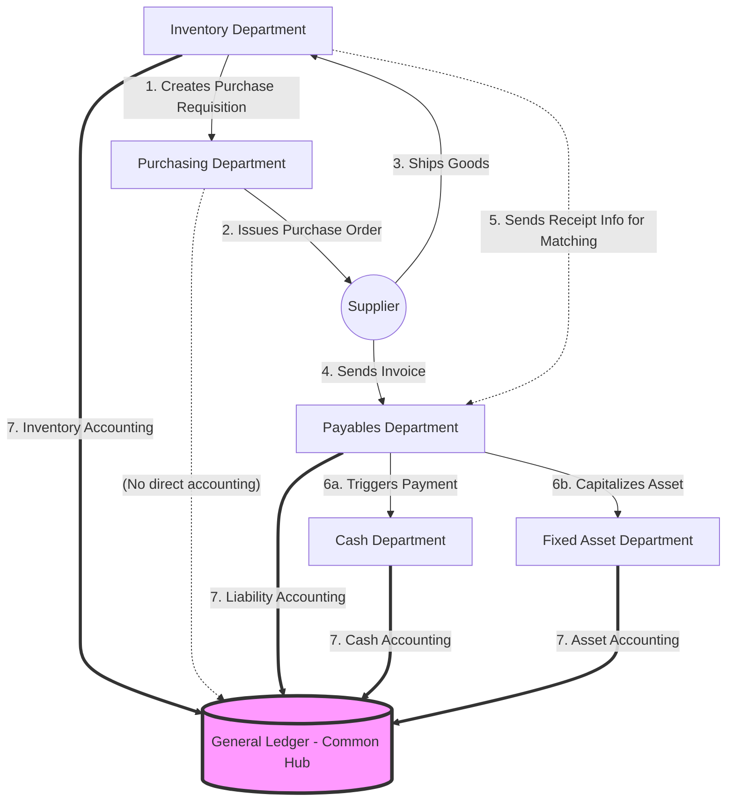

# Day 3 — Oracle Fusion Procure-to-Pay (P2P) Cycle

**Topic:** The Purchase Process and Departmental Flow

In Oracle Fusion, buying something for a company isn't just a single click. It involves an entire lifecycle called the **Procure-to-Pay (P2P)** cycle. This process touches multiple different departments and Oracle modules before the transaction is fully complete.

## 1. The Core Departments in the P2P Cycle

Let's break down the journey of purchasing items (like new laptops for the company) and see how the departments interact:

### 1. Inventory / Warehouse Department
- **Action:** They realize stock is low or a new requirement arises. They create a **Purchase Requisition (PR)** asking for permission to buy.
- **Action (Later):** Once the supplier delivers the laptops, this department receives them into the warehouse and generates a **Goods Receipt**.

### 2. Purchasing (Procurement) Department
- **Action:** They receive the Requisition from Inventory. They negotiate with suppliers and officially issue a **Purchase Order (PO)** to the chosen vendor to buy the laptops.

### 3. Payables (Accounts Payable) Department
- **Action:** The supplier ships the laptops and sends an **Invoice** (the bill). 
- **Matching:** The Payables department receives this invoice and performs a "3-Way Match" (They check the original PO, the Goods Receipt from Inventory, and the Invoice to make sure quantities and prices match).

### 4. Cash Management Department
- **Action:** Once Payables approves the invoice, the Cash department takes over to actually pay the supplier. They issue the check or wire transfer and ensure the company's bank statements reconcile with the system.

### 5. Fixed Assets Department (Conditional)
- **Action:** If the company bought standard supplies (like pens), Assets is not involved. However, because we bought *laptops* (which are long-term capital assets), Payables sends the invoice details to the Asset Department. The Asset team capitalizes the laptops and tracks their depreciation over time.

### 6. General Ledger (GL) - The Common Hub
- **Action:** The GL is the central nervous system of Oracle ERP. **Every single department mentioned above pushes their accounting data into the General Ledger.** Inventory sends valuation data, Payables sends liabilities, Cash sends bank clearing data, and Assets sends depreciation. GL consolidates it all to create the final Balance Sheet and Profit & Loss statements.

---

## 2. Visualizing the Flow (Mermaid Graph)

Here is a visual representation of how the data and responsibilities flow between the departments:

### Summary of the Flow
1. **Inventory** asks for it.
2. **Purchasing** orders it.
3. **Payables** verifies the bill.
4. **Cash** pays the bill.
5. **Assets** tracks the value (if it's a long-term item).
6. **General Ledger** records everything for the financial statements.
