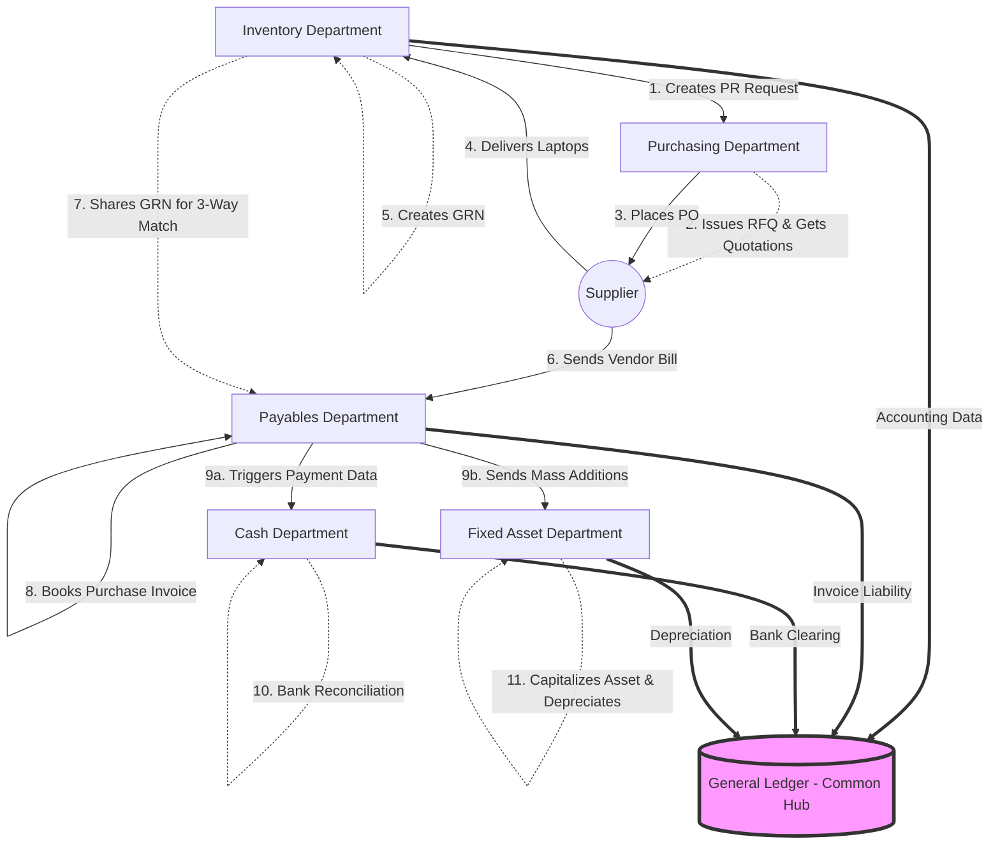

# Day 3 — Oracle Fusion Procure-to-Pay (P2P) Cycle

**Topic:** The Purchase Process and Departmental Flow

In Oracle Fusion, buying something for a company isn't just a single click. It involves an entire lifecycle called the **Procure-to-Pay (P2P)** cycle. This process touches multiple different departments and Oracle modules before the transaction is fully complete.

## 1. Real-World Example: Buying 100 Laptops
To understand the Procure-to-Pay process, let's look at a real-world scenario where a company needs to buy 100 laptops. Here is how the transaction flows across different departments in Oracle Fusion:

### Step 1: Inventory / Warehouse Department
- **Stock Check:** The process starts here. The department checks if there are 100 laptops in stock. 
- **Purchase Requisition (PR):** Since there is no stock, they create a **Purchase Requisition (PR)** requesting to buy 100 laptops.
- **Approvals:** The PR is sent for internal approvals (e.g., the IT Manager approves the request).

### Step 2: Purchasing (Procurement) Department
- **RFQ Creation:** The Purchasing team receives the approved PR. They create a **Request for Quotation (RFQ)** and send it to multiple suppliers.
- **Quotation Analysis:** Various vendors reply with their quotations (pricing). The Purchasing team analyzes the quotes and selects the best vendor.
- **Purchase Order (PO):** They place a formal **Purchase Order (PO)** with the chosen vendor. This PO also goes through an internal approval hierarchy before being sent to the vendor.

### Step 3: Receiving (Inventory Department)
- **GRN (Goods Receipt Note):** The vendor delivers the 100 laptops. The Inventory team receives them into the warehouse and creates a **GRN (Goods Receive Note)** in the system.
- **Purchase Returns:** If any laptops are damaged or defective, the Inventory team will process a Purchase Return back to the vendor.

### Step 4: Payables (Accounts Payable) Department
- **Purchase Invoice (PI):** The vendor sends the bill. The Payables team enters this into the system as a Purchase Invoice. 
- ***Crucial Rule:*** Whether you are buying an *Item* (laptop), a *Service* (office cleaning), an *Expense* (employee travel), or a *Fixed Asset* (machinery), **all of them must have a Purchase Invoice booked in the Payables department.**
- **Payment Initiation:** Once the invoice is validated against the PO and GRN, Payables marks it as ready for payment.

### Step 5: Fixed Asset Department (Capitalization)
- **Data Sharing:** The Payables team does not share every invoice with the Assets team—they **only share Fixed Asset-related Purchase Invoices** (like these laptops). 
- **Asset Creation:** The Asset team receives this data, creates the laptops as "Fixed Assets" in the system, and sets up rules to calculate **Depreciation** over the next few years.

### Step 6: Cash Management Department
- **Payment & Bank Accounts:** Payables tells the Cash Department about the payment transaction. The Cash Department actually holds and manages the company's **Bank Accounts**. They process the final payment out of the bank.
- **Bank Statement Reconciliation:** The Cash Department must reconcile internal system records with actual bank statements. *For example: If the Payables module says 15 payments were issued today, but the daily bank statement shows only 10 payments actually cleared the bank, the Cash team must investigate and reconcile the issue.*

### Step 7: General Ledger (The Common Department)
- **Reporting:** The General Ledger (GL) is the "common department" where all the financial data from Inventory, Purchasing, Payables, Assets, and Cash flows together. If management needs a **Financial Report** (like a Balance Sheet, P&L, or custom audit report), the GL team generates it from this centralized hub.

---

## 2. Visualizing the Flow (Mermaid Graph)

Here is a visual representation of how the data and responsibilities flow between the departments:

### Summary of the Flow
1. **Inventory** asks for the laptops (PR) and receives them (GRN).
2. **Purchasing** requests quotes (RFQ) and buys them (PO).
3. **Payables** books the bill (Purchase Invoice).
4. **Assets** tracks the laptops as long-term investments (Capitalization).
5. **Cash** actually pays for them and checks the bank (Reconciliation).
6. **General Ledger** builds the final reports from everyone's data.
