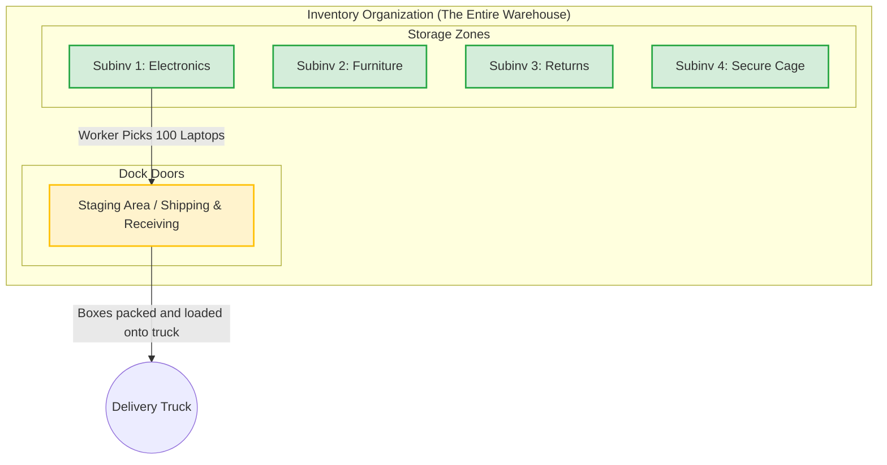

# Day 4 — Oracle Fusion Order-to-Cash (O2C) Cycle

**Topic:** The Sales Cycle and Warehouse Management

While Day 3 covered how we *buy* things (Procure-to-Pay), Day 4 covers how we *sell* things. In Oracle Fusion, the sales process is known as the **Order-to-Cash (O2C)** cycle. 

To understand this, let's walk through an example where a customer calls and wants to buy **100 Laptops**.

---

## 1. The Sales Flow (Selling 100 Laptops)

### Step 1: Inventory Check
Before we can sell anything, the system must check the **Inventory Department** to see if we have enough stock.

- **Scenario A: No Stock Available**
  - If we only have 10 laptops, we cannot fulfill the order.
  - The system will automatically pause the sales cycle and trigger the **Purchasing Process (P2P)** we learned in Day 3. It will create a Purchase Order (PO) to buy laptops from our supplier. Once the inventory is filled, the sales cycle resumes. *(This is often called Back-to-Back order fulfillment).*

- **Scenario B: Stock is Available**
  - The system checks and sees we currently have **1,000 laptops** in stock.
  - We have plenty of inventory, so the system immediately proceeds to the next step.

### Step 2: Sales Department (Order Management)
Because we have the stock, the Sales Department takes over to process the customer's request.

1. **Create Sales Order (SO):** The sales rep enters the customer's details, the item (100 laptops), the price, and the requested delivery date into the system. This creates a Draft Sales Order.
2. **Book Sales Order:** Once the customer confirms, the rep clicks "Book". Booking the order officially locks it in. It reserves the 100 laptops in the warehouse so no one else can buy them, and signals the warehouse team to start packing.

---

## 2. Deep Dive: Inside the Warehouse (Inventory Org Structure)

When the Sales Order is booked, the physical work begins. But how does Oracle actually organize a physical warehouse in the software? 

In Oracle, a warehouse is called an **Inventory Organization (Inv Org)**. Inside that organization, the space is divided into logical zones.

### The Structure Breakdown:
1. **Inventory Organization (Inv Org):** The overarching facility (e.g., "New York Main Warehouse").
2. **Subinventories (Subinv):** These are specific rooms, aisles, or zones inside the warehouse where goods are physically stored. You can have many subinventories.
   - *Subinv 1:* Electronics (Where our 1,000 laptops are stored)
   - *Subinv 2:* Office Furniture
   - *Subinv 3:* Defective/Returns
   - *Subinv 4:* High-Value Secure Cage
3. **Staging Area (Shipping/Receiving):** This is a very special, temporary subinventory located right by the loading dock doors. 
   - When the warehouse worker picks the 100 laptops from *Subinv 1*, they don't immediately hand them to the FedEx driver. 
   - First, they move the laptops to the **Staging Area**. Here, the items sit temporarily while they are put into boxes, labeled, and prepared for final shipment.

---

## 3. Visualizing the Warehouse Architecture

Here is how Oracle Fusion logically visualizes the physical layout of the warehouse to process your 100 laptops:

### Summary of the Pick & Ship Process:
1. **Pick Release:** The system tells the warehouse worker to go to *Subinv 1* to grab 100 laptops.
2. **Pick Confirm:** The worker confirms they moved the laptops from *Subinv 1* to the **Staging Area**.
3. **Ship Confirm:** The truck arrives, the boxes are loaded, and the laptops officially leave the Staging Area to go to the customer.
