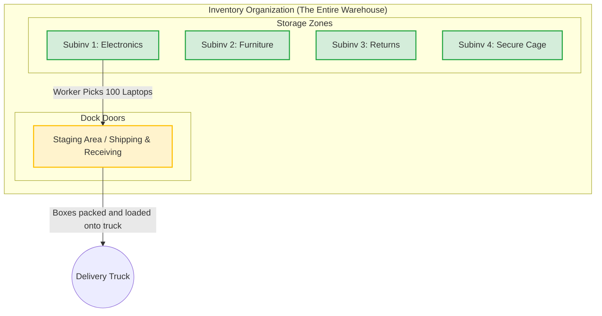

# Day 4 — Oracle Fusion Order-to-Cash (O2C) Cycle

**Topic:** The Sales Cycle and Warehouse Management

While Day 3 covered how we *buy* things (Procure-to-Pay), Day 4 covers how we *sell* things. In Oracle Fusion, the sales process is known as the **Order-to-Cash (O2C)** cycle. 

To understand this, let's walk through an example where a customer calls and wants to buy **100 Laptops**.

---

## 1. Official Oracle Fusion Module Abbreviations (The O2C Stack)
Just like the buying cycle, professionals use official acronyms when discussing the Order-to-Cash cycle modules. You must memorize these:

- **INV** = Oracle Fusion Inventory
- **OM** = Oracle Fusion Order Management
- **AR** = Oracle Fusion Accounts Receivable
- **CM** = Oracle Fusion Cash Management
- **GL** = Oracle Fusion General Ledger

---

## 2. The Sales Flow (Selling 100 Laptops)

### Step 1: Inventory Check
Before we can sell anything, the system must check the **Inventory Department** to see if we have enough stock.

- **Scenario A: No Stock Available**
  - If we only have 10 laptops, we cannot fulfill the order.
  - The system will automatically pause the sales cycle and trigger the **Purchasing Process (P2P)** we learned in Day 3. It will create a Purchase Order (PO) to buy laptops from our supplier. Once the inventory is filled, the sales cycle resumes. *(This is often called Back-to-Back order fulfillment).*

- **Scenario B: Stock is Available**
  - The system checks and sees we currently have **1,000 laptops** in stock.
  - We have plenty of inventory, so the system immediately proceeds to the next step.

### Step 2: Sales Department (Order Management)
Because we have the stock, the Sales Department takes over to process the customer's request.

1. **Create Sales Order (SO):** The sales rep enters the customer's details, the item (100 laptops), the price, and the requested delivery date into the system. This creates a Draft Sales Order.
2. **Book Sales Order:** Once the customer confirms, the rep clicks "Book". Booking the order officially locks it in. It reserves the 100 laptops in the warehouse so no one else can buy them, and signals the warehouse team to start packing.

---

## 3. Deep Dive: Inside the Warehouse (Inventory Org Structure)

When the Sales Order is booked, the physical work begins. But how does Oracle actually organize a physical warehouse in the software? 

In Oracle, a warehouse is called an **Inventory Organization (Inv Org)**. Inside that organization, the space is divided into logical zones.

### The Structure Breakdown:
1. **Inventory Organization (Inv Org):** The overarching facility (e.g., "New York Main Warehouse").
2. **Subinventories (Subinv):** These are specific rooms, aisles, or zones inside the warehouse where goods are physically stored. You can have many subinventories.
   - *Subinv 1:* Electronics (Where our 1,000 laptops are stored)
   - *Subinv 2:* Office Furniture
   - *Subinv 3:* Defective/Returns
   - *Subinv 4:* High-Value Secure Cage
3. **Staging Area (Shipping/Receiving):** This is a very special, temporary subinventory located right by the loading dock doors. 
   - When the warehouse worker picks the 100 laptops from *Subinv 1*, they don't immediately hand them to the FedEx driver. 
   - First, they move the laptops to the **Staging Area**. Here, the items sit temporarily while they are put into boxes, labeled, and prepared for final shipment.

---

## 4. Visualizing the Warehouse Architecture

Here is how Oracle Fusion logically visualizes the physical layout of the warehouse to process your 100 laptops:

## 5. The Communication Between Sales and Inventory

Once the Sales Order is booked, the **Sales Department (Order Management)** and the **Inventory Department** must constantly talk to each other to fulfill the order.

Here is the exact step-by-step technical handshake:

1. **Pick Release (Sales ➔ Inventory):** 
   - The Sales team initiates a "Pick Release". This sends a digital signal to the warehouse saying, *"Go grab the 100 laptops from Subinv 1!"*
2. **Pick Confirm (Internal to Inventory):** 
   - The warehouse worker finds the laptops in Subinv 1 and moves them to the Staging Area. They log this in the system as a "Pick Confirm".
3. **Ship Confirmation (Inventory ➔ Sales):** 
   - The delivery truck arrives, the laptops are loaded, and the truck drives away. 
   - The Inventory department performs a **"Ship Confirm"**. This crucial step tells the Sales system, *"The item went out."* The system immediately deducts 100 laptops from the on-hand stock and tells the finance department to generate the customer's invoice.
4. **Customer Return / Sales Returns (Sales ➔ Inventory):**
   - What happens if the laptops reach the customer's warehouse, but 5 of them have shattered screens? 
   - The customer will send them back. The Sales department will create an **RMA (Return Material Authorization)** to log a "Sales Return". When the delivery truck brings them back, the Inventory department receives them into a specific subinventory (like *Subinv 3: Returns*) so they aren't accidentally sold to someone else.

---

## 6. The Financial Flow (Getting Paid!)
Once the laptops are shipped (Ship Confirm), the physical warehouse job is done. Now, the financial departments take over to make sure the company actually gets paid.

### Step 3: Receivables Department (AR)
- **Sales Invoice:** Triggered automatically by the Ship Confirm, the Accounts Receivable (AR) team generates the Sales Invoice and sends it to the customer. 
- **Receipt:** When the customer pays (e.g., they send a check or wire transfer for the 100 laptops), the AR team logs this in the system as a **Receipt**. *(Note: In AR, a "Receipt" means receiving money, whereas in Inventory, a "Receipt/GRN" means receiving physical goods).*

### Step 4: Cash Management Department (CE / CM)
- **Bank Accounts:** Just like in the P2P cycle, the Cash Department manages the actual, physical bank accounts.
- **Bank Statement Reconciliation:** The Cash team downloads the daily electronic Bank Statement and matches the real-world bank data against the "Receipts" logged by the AR team. 

> **Example Issue: Unreconciled Receipts**
> **The Problem:** The Receivables (AR) system shows **20 Receipts** logged today by the AR clerks. However, when the Cash team downloads the Bank Statement, it only shows **10 Receipts** actually clearing the bank account. 
> 
> **Why did this happen? (The Issue):** 
> 1. *Timing Delays (Float):* The customer mailed a check, the AR clerk logged the Receipt today, but the bank won't actually clear the funds for another 3 days.
> 2. *Data Mismatch:* The bank statement transaction number or date doesn't match the system receipt perfectly, so the Oracle Auto-Reconciliation engine skipped it.
> 
> **How to fix it (The Solution):**
> The Cash team must perform a **Manual Reconciliation**. They navigate to *Cash Management > Bank Statements and Reconciliation > Manual Reconciliation*. From there, they manually find the 10 missing system receipts and force-match them to the bank line. If the bank genuinely rejected the payments, AR must reverse the receipt and contact the customer.

### Step 5: Common Department (General Ledger - GL)
- Just like the buying cycle, the selling cycle ends in the **General Ledger**. 
- The GL team takes the revenue data from AR and the cash data from CM to generate the final **Profit & Loss (P&L)** reports for the management team.

---

> **Conclusion:** This entire end-to-end flow—from the customer asking for laptops, to checking inventory, picking and shipping them, billing the customer, reconciling the bank account, and generating the financial reports—is the complete **Order-to-Cash (O2C) Cycle**!
